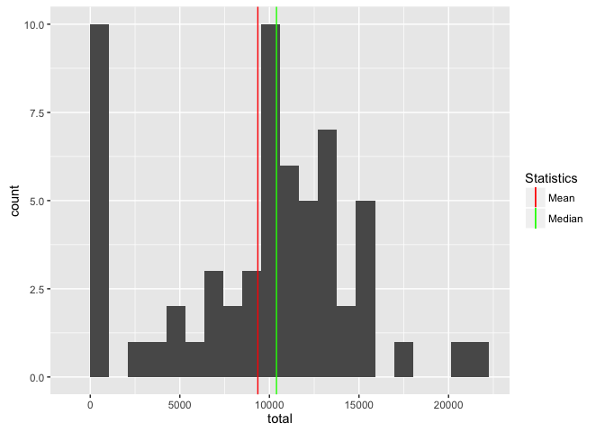
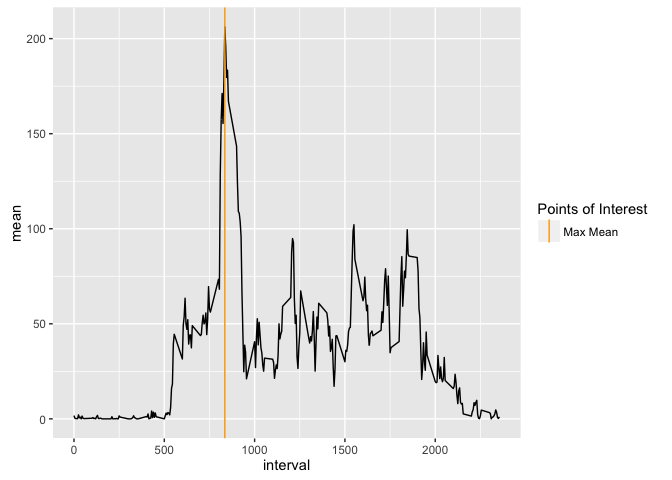

# Reproducible Research: Peer Assessment 1

## Initialise the environment

```r
library(dplyr)
library(lubridate)
library(ggplot2)
```

## Loading and preprocessing the data

```r
steps <- read.csv("activity.csv")
steps <- steps %>% mutate(date=ymd(date))
```

## What is mean total number of steps taken per day?

```r
steps_per_day  <- steps %>% group_by(date) %>% summarise(total=sum(steps,na.rm=TRUE))

mean_steps_per_day <- mean(steps_per_day$total,na.rm=TRUE)
median_steps_per_day <- median(steps_per_day$total,na.rm=TRUE)

ggplot(steps_per_day,aes(total))+
  geom_histogram(bins = 20)+
  geom_vline(aes(xintercept = mean_steps_per_day,color="Mean"))+
  geom_vline(aes(xintercept = median_steps_per_day,color="Median")) +
  scale_color_manual("Statistics", values = c("Mean" = "red", "Median" = "green"))
```



The mean number of steps per day are ``9354.2295082`` and the median number of steps per day are ``10395``.


## What is the average daily activity pattern?

```r
daily_activity <- steps %>% group_by(interval) %>% summarise(mean=mean(steps,na.rm=TRUE))

max_mean <- daily_activity %>% filter(mean == max(daily_activity$mean))

ggplot(daily_activity,aes(interval,mean)) + 
  geom_line() +
  geom_vline(aes(xintercept=max_mean$interval,color="Max Mean")) +
  scale_color_manual("Points of Interest", values=c("Max Mean"="orange"))
```



On average the '''r max_mean''' interval contains the maximun number of steps. 


## Inputing missing values

```r
na_steps <- steps %>% filter(is.na(steps))
no_na_steps <- dim(na_steps)[1]
```

The dataset contains ``2304`` rows that has missing step values. In order to fix this I will replace the missing values with the average values for the affected interval across all days.


```r
fix <- function(v,m) {
  
  print(head(v))
  print(head(m))
  if(is.na(v)) 
    return(m)
  else 
    return(v)
}
#steps_fixed <- steps %>% mutate(steps = fix(steps,daily_activity$mean))
#daily_activity
```


## Are there differences in activity patterns between weekdays and weekends?
