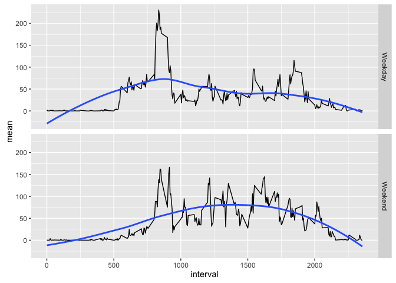

# Reproducible Research: Peer Assessment 1

## Initialise the environment

```r
library(dplyr)
library(lubridate)
library(ggplot2)
options(scipen = 2, digits = 2)
```

## Loading and preprocessing the data

```r
steps <- read.csv("activity.csv")
steps <- steps %>% mutate(date=ymd(date))
```

## What is mean total number of steps taken per day?

```r
steps_per_day  <- steps %>% 
  group_by(date) %>% 
  summarise(total=sum(steps,na.rm=TRUE))

mean_steps_per_day <- mean(steps_per_day$total,na.rm=TRUE)
median_steps_per_day <- median(steps_per_day$total,na.rm=TRUE)

p1 = ggplot(steps_per_day,aes(total))+
  geom_histogram(bins = 20)+
  geom_vline(aes(xintercept = mean_steps_per_day,color="Mean"))+
  geom_vline(aes(xintercept = median_steps_per_day,color="Median")) +
  scale_color_manual("Statistics", values = c("Mean" = "red", "Median" = "green"))

print(p1)
```


The mean number of steps per day are ``9354.23`` and the median number of steps per day are ``10395``.


## What is the average daily activity pattern?

```r
daily_activity <- steps %>% group_by(interval) %>% summarise(mean=mean(steps,na.rm=TRUE))

max_mean <- daily_activity %>% filter(mean == max(daily_activity$mean))

ggplot(daily_activity,aes(interval,mean)) + 
  geom_line() +
  geom_vline(aes(xintercept=max_mean$interval,color="Max Mean")) +
  scale_color_manual("Points of Interest", values=c("Max Mean"="orange"))
```


On average the ``835``th interval contains the maximun number of steps. 


## Inputing missing values

```r
na_steps <- steps %>% filter(is.na(steps))
no_na_steps <- dim(na_steps)[1]
```

The dataset contains ``2304`` rows that has missing step values. In order to fix this I will replace the missing values with the average values for the affected interval across all days.


```r
fixed_steps <- steps %>% 
  inner_join(daily_activity,by="interval") %>% 
  mutate(steps = ifelse(is.na(steps),mean,steps)) %>% 
  select(-mean)

fixed_steps_per_day  <- fixed_steps %>% 
  group_by(date) %>% 
  summarise(total=sum(steps))

fixed_mean_steps_per_day <- mean(fixed_steps_per_day$total)
fixed_median_steps_per_day <- median(fixed_steps_per_day$total)

p2 = ggplot(fixed_steps_per_day,aes(total))+
  geom_histogram(bins = 20)+
  geom_vline(aes(xintercept = fixed_mean_steps_per_day,color="Mean"))+
  geom_vline(aes(xintercept = fixed_median_steps_per_day,color="Median")) +
  scale_color_manual("Statistics", values = c("Mean" = "red", "Median" = "green"))

print(p2)
```


The mean number of steps per day are ``10766.19`` and the median number of steps per day are ``10766.19``.

For ease of reference here is the histogram again for the non fixed data. Fixing the data has had a marked effect on the mean and the median of the data. The mean is bigger (``9354.23`` to ``10766.19``) and the median is also bigger (``10395`` to ``10766.19``). By introducing the fix the mean and median has convered to ``10395``.


```r
print(p1)
```


## Are there differences in activity patterns between weekdays and weekends?

```r
daily_activity_week <- fixed_steps %>% 
  mutate(weekday = ifelse(weekdays(date) %in% c("Sunday","Saturday"),"Weekend","Weekday")) %>%
  group_by(interval,weekday) %>% 
  summarise(mean=mean(steps,na.rm=TRUE)) 


p3 = ggplot(daily_activity_week, aes(interval, mean)) +
  geom_line() +
  geom_smooth(se=FALSE) +
  facet_grid(weekday ~ .)

print(p3)
```



From the graphs above there is most definately differences between the activity patters on weekends and weekdays. Most notably:

1. On weekends activity start later and continue for longer.
2. On weekdays there is a peak of activity near the start of the work day and the end of the day.
3. On weekends a higher level of ativity is sustained di=uring the course of the day.


